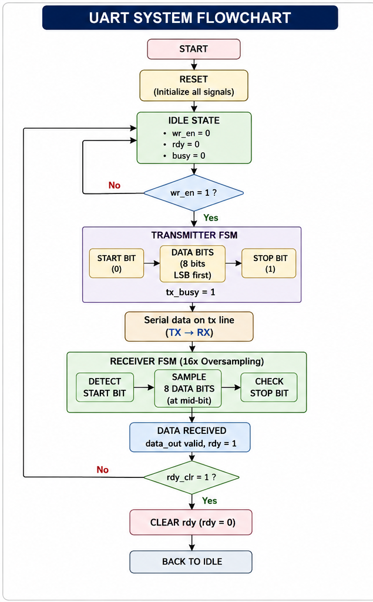
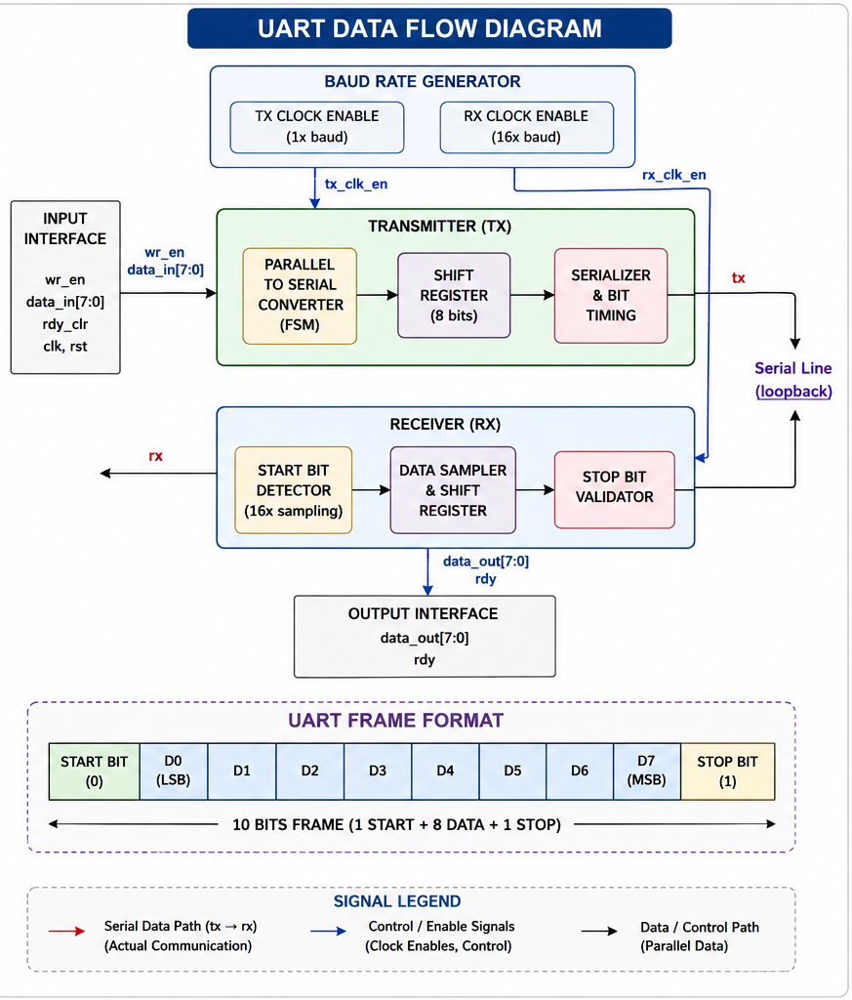
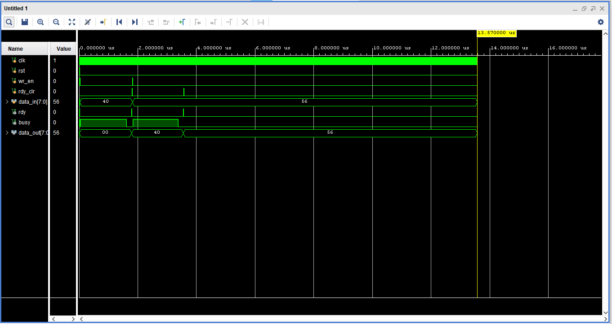

# 🚀 UART Transmitter and Receiver in Verilog


---

## **📌 Overview**

A complete **UART (Universal Asynchronous Receiver Transmitter)** communication system designed in **Verilog HDL** using **Finite State Machines (FSM)**.

This project implements:

- **UART Transmitter (TX)**
- **UART Receiver (RX)**
- **Baud Rate Generator**
- **Self-checking Testbench**

👉 Designed for **FPGA implementation, ASIC design flow, and digital communication systems**

---

## **⚡ Key Highlights**

✔ **FSM-based UART design**  
✔ **16x oversampling receiver (industry standard)**  
✔ **Configurable baud rate**  
✔ **Loopback verification (TX → RX)**  
✔ **Self-checking testbench**  
✔ **Clean modular architecture**

---
## **🧱 System Architecture**
```


           +---------------------+
           |   baudrate_gen      |
           | (TX & RX Clocks)    |
           +----------+----------+
                      |
        +-------------+-------------+
        |                           |
+---------------+           +---------------+
| transmitter   |   tx ---> | receiver      |
|   (TX FSM)    |           |   (RX FSM)    |
+---------------+           +---------------+
        |                           |
        +-------------+-------------+
                      |
                +-----------+
                | uart_top  |
                +-----------+
```

👉 TX output is internally looped to RX for verification

---

## **⚡ How It Works**

1. `wr_en` triggers data transmission  
2. Transmitter converts **parallel → serial**  
3. Data is sent as UART frame:
   - Start bit (0)  
   - 8 data bits (LSB first)  
   - Stop bit (1)  
4. Receiver detects start bit  
5. Samples data at mid-bit using oversampling  
6. Reconstructs byte and sets `rdy = 1`  

---

## **📡 UART Frame Format**

| Start | Data (8 bits) | Stop |
|------|--------------|------|
|  0   | LSB → MSB    |  1   |

---

## **📂 Project Structure**
```
UART-Transmitter-and-Receiver-in-Verilog/
│
├── rtl/
│   ├── baudrate_gen.v
│   ├── transmitter_tx.v
│   ├── receiver_rx.v
│   └── uart_top.v
│
├── sim/
│   └── uart_top_tb.v
│
├── docs/
│   └── uart_diagram.png
│
├── README.md
└── .gitignore

```

## **⚙️ Module Description**

### **🔹 Baud Rate Generator**
- Generates clock enable signals for TX and RX  
- RX uses **16× oversampling**
- TX divisor = clk_freq / baud_rate
- RX divisor = clk_freq / (16 × baud_rate)


---

### **🔹 Transmitter (TX)**

FSM States:
- **IDLE** → Wait for `wr_en`
- **START** → Send start bit  
- **DATA** → Send 8 bits (LSB first)  
- **STOP** → Send stop bit  

---

### **🔹 Receiver (RX)**

FSM States:
- **START** → Detect start bit  
- **DATA** → Sample bits at mid-point  
- **STOP** → Validate stop bit  

✔ Noise-resistant sampling  
✔ Accurate data reconstruction  

---

### **🔹 Top Module**

Integrates:
- Baud generator  
- TX module  
- RX module  

Loopback connection:

tx → rx

---

## **🧪 Verification Strategy**

- Loopback testing  
- Multiple data patterns  
- Edge cases:
  - `0x00`
  - `0xFF`
  - `0xAA`
  - `0x55`

---

## **▶️ Simulation**

### ModelSim / QuestaSim / Xilinx Vivado

```tcl
vlog rtl/*.v
vlog sim/*.v
vsim uart_top_tb
run -all
```
**📊 Expected Output**

PASS: Received 40
PASS: Received 56
PASS: Received AA
PASS: Received FF


**📷 Flowchart**



**📡 Data Flow**



**📈 Waveform**



**⚠️ Simulation Note**

For simulation:

parameter clk_freq  = 160;
parameter baud_rate = 10;

For real FPGA:

parameter clk_freq  = 50_000_000;
parameter baud_rate = 115200;


**💡 Key Concepts Used**

Finite State Machine (FSM)
Serial Communication
Oversampling Technique
Clock Division
Digital Design


**🚀 Applications**

Embedded systems UART communication
FPGA-based serial interfaces
Debug communication channels
Industrial communication systems


**💼 Project Highlights**

Designed a complete UART system from scratch
Implemented FSM-based TX and RX
Built self-checking verification testbench
Achieved reliable communication using oversampling


**👨‍💻 Author**

Neel Raval